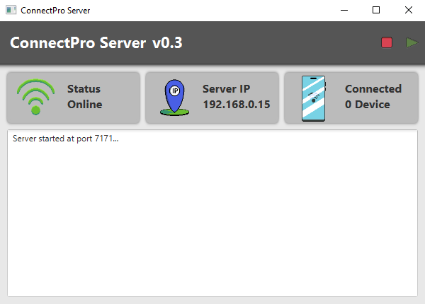

# Connect Pro Desktop
A JavaFx program to control your pc remotly by socket.



## Requeriments
- OpenJDK 23 (https://jdk.java.net/23/)
- OpenJFX (https://jdk.java.net/javafx23/)
- Intellij IDEA 2024 (https://www.jetbrains.com/idea/download/download-thanks.html?platform=windows&code=IIC)
- JavaFx Scene Builder (https://www.oracle.com/java/technologies/javafxscenebuilder-1x-archive-downloads.html)
- Wix Toolset v3 (https://wixtoolset.org/docs/wix3/)

## About the Project
This project was developed to enable a client to remotely connect and control a PC, using this server as a gateway. The server will receive commands from the client and execute them on the local machine.

## Features

* Remote connection via socket
* PC remote control through client-server communication
* Security guaranteed by means of the TCP/IP protocol
* Flexibility with support for various devices (clients)

## Functionalities

* Establishing connections with clients
* Receiving commands from clients and executing them on the local machine
* Implementing authentication and authorization for secure access
* Support for multiple simultaneous connections

## Installation

1. Download and install OpenJDK 23 (https://jdk.java.net/23/)
2. Download and install OpenJFX 23 (https://jdk.java.net/javafx23/)
3. Clone or download the project source code
4. Run the application using Java

## Configuration

To configure the server, you need to define the following properties:
* Port: 7171 (default)
* IP Address: (default)

## Build and Deploy for Windows

To build and deploy the project, you need to install the Wixtoolset from https://wixtoolset.org/docs/wix3/. Then, run the following command to generate a Windows installer:
```bash
jpackage --type msi --app-version "0.3" --input . --dest . --main-jar ConnectProServer.jar --main-class com.connectpro.connectproserver.App --module-path "C:\Java\javafx-jmods-23.0.1" --add-modules javafx.controls,javafx.fxml --win-shortcut --win-menu --name "Connect Pro Server" --app-version "1.1" --description "Server to allow remote control pc."
```
## Contribution
This is an open-source project and we are always looking for contributions! If you have any suggestion or problem, feel free to open an issue here on GitHub.
